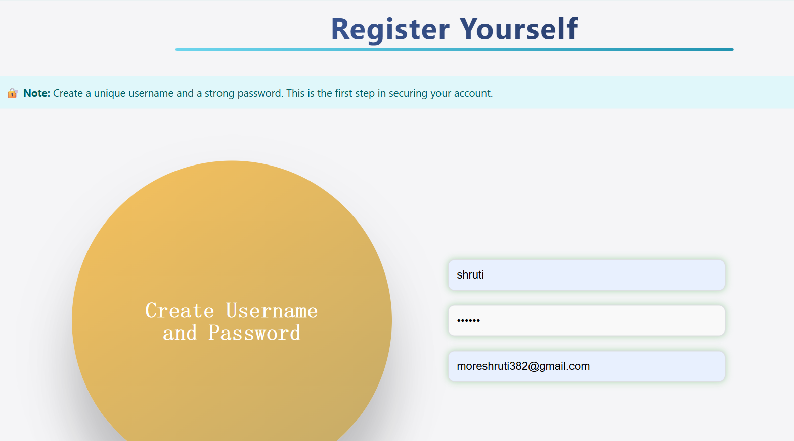
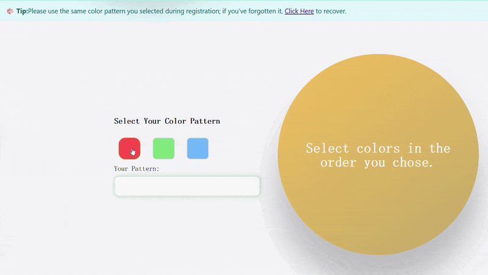
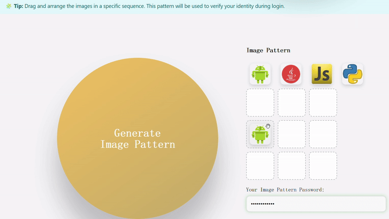

# 🔐 Triple Lock Authentication System

A secure **three-level authentication system** developed using **Spring Boot**, **Hibernate**, and **MySQL**, designed to enhance cybersecurity by implementing:

1. **Simple Password Authentication**
2. **Color Pattern Selection**
3. **Image Pattern Drag-and-Drop Verification**

---

## 🚀 Features

- 🔒 Three-step authentication for login and registration
- 🧠 Secure storage of user credentials using Hibernate (JPA)
- 💾 MySQL database integration for persistent data storage
- ⚙️ RESTful APIs for backend processing
- 🎨 Clean and responsive frontend (Thymeleaf or HTML/CSS/JS)

---

## 🛠️ Tech Stack

| Category        | Technology                             |
|-----------------|----------------------------------------|
| Backend         | Spring Boot, Java                      |
| ORM             | Hibernate (JPA)                        |
| Database        | MySQL                                  |
| Frontend        | HTML, CSS, JavaScript, Thymeleaf       |
| Build Tool      | Maven                                  |
| IDE             | IntelliJ IDEA / Eclipse                |

---

## ⚙️ Project Implementation and Working

### 🔍 Overview

The **Triple Lock Authentication System** enhances login security using **three distinct verification layers**. Each step is carefully designed to ensure both usability and protection against unauthorized access.

---

### 🔐 1. Simple Password Authentication  
Users begin with a **traditional login** using a secure username and password. This is the **first layer of authentication**.
  

  

---

### 🎨 2. Color Pattern Selection  
In the second step, users **select a predefined color sequence**. This layer adds a **visual memory-based authentication** element, strengthening security.

  

---

### 🧩 3. Image Pattern Drag-and-Drop  
Finally, users **drag and drop images into a specific order** they set during registration. This introduces an **interactive, image-based security** step.
 

  

---

